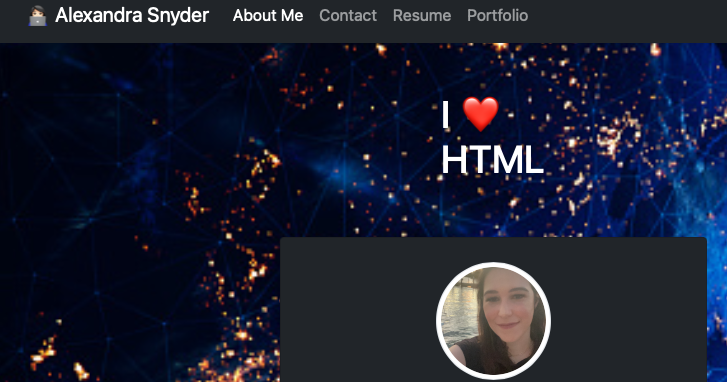

# My REACT Portfolio

## Description

I am very proud of my portfolio which I created using REACT. My portfolio contains links and pictures of my projects , as well as ways to contact me , and a shrt bio about who I am! 

## Table of Contents

* [Installation](#installation)
* [Usage](#usage)
* [Tests](#tests)
* [License](#license)
* [Contributing](#contributing)
* [Credits](#credits)
* [Questions](#questions)

## Installation

In the project directory, you can run:

### `npm start`

Runs the app in the development mode.\
Open [http://localhost:3000](http://localhost:3000) to view it in your browser.

The page will reload when you make changes.\
You may also see any lint errors in the console.

## Usage

link to my website 

(My REACT portfolio)[https://alysnyder.github.io/my-REACT-portfolio/]

## Tests

Tests have not been made for this app. 

## License

This app is governed by MIT license.

## Contributing 

If you are interested in contacting me for this project or future work , feel free to reach me via e-mail at alystrife@gmail.com.

## Credits 

Alex Snyder - (Alex Snyder)[https://github.com/AlySnyder]

## Screenshot

## Questions

If you have any questions , feel free to any of the contributers listed on this repo by clicking the link to their profile, you can reach me via e-mail at alystrife@gmail.com. # Getting Started with Create React App

This project was bootstrapped with [Create React App](https://github.com/facebook/create-react-app).
